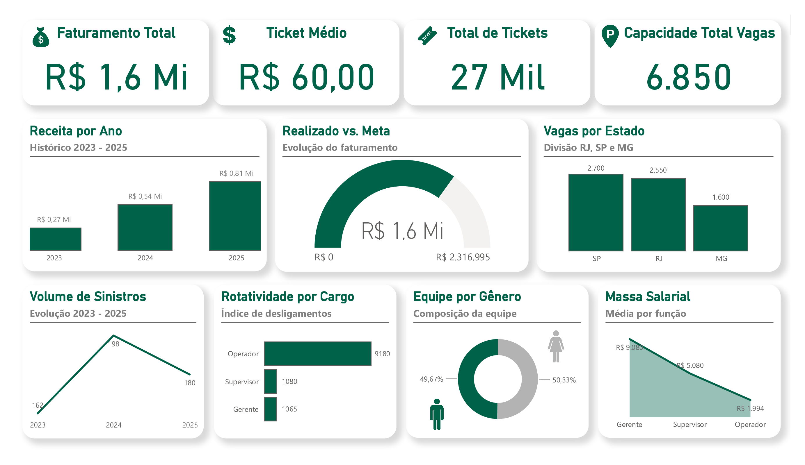

# UrbanPark: Gestão Estratégica de Operações de Estacionamento 🚗📊
## Dashboard de Performance Operacional e Business Intelligence 📈

---

##  Descrição do Projeto
O **UrbanPark** é uma solução de Business Intelligence voltada para a gestão de grandes operações de estacionamento. O projeto consolida dados financeiros, operacionais e de capital humano para oferecer uma visão 360° da saúde do negócio, permitindo o controle rigoroso de metas, sinistros e capacidade operacional.

##  Project Description
**UrbanPark** is a Business Intelligence solution designed for large-scale parking operations. The project consolidates financial, operational, and human capital data to provide a 360° view of business health, enabling strict control over goals, claims (insurance), and operational capacity.

---

## 🚀 Resultados e Insights | Results & Insights

###  Impacto Organizacional
* **Monitoramento de Performance:** Acompanhamento em tempo real do faturamento (**R$ 1,6 Mi**) vs. Meta estabelecida.
* **Segurança e Risco:** Análise histórica de sinistros para identificação de padrões de avarias e melhoria de processos.
* **Eficiência de Ocupação:** Distribuição estratégica de **6.850 vagas** entre unidades regionais (RJ, SP e MG).

###  Organizational Impact
* **Performance Monitoring:** Real-time tracking of revenue (**$1.6M**) vs. established goals.
* **Safety & Risk:** Historical analysis of claims to identify damage patterns and improve operational processes.
* **Occupancy Efficiency:** Strategic distribution of **6,850 parking spaces** across regional units (RJ, SP, and MG).

---

## 🛠️ Destaques Técnicos | Technical Highlights

###  Funcionalidades Principais
* **Data Storytelling:** Design minimalista focado na experiência do usuário e rápida leitura de KPIs.
* **Análise de RH:** Visibilidade sobre rotatividade por cargo, paridade de gênero e massa salarial.
* **KPIs Centrais:** Faturamento Total, Ticket Médio, Volume de Tickets e Capacidade de Vagas.

###  Key Features
* **Data Storytelling:** Minimalist design focused on user experience and quick KPI scanning.
* **HR Analytics:** Visibility into turnover by role, gender parity, and payroll distribution.
* **Core KPIs:** Total Revenue, Average Ticket, Ticket Volume, and Parking Capacity.

---

## 🔧 Ferramentas | Tools
* **Power BI:** Dashboards Interativos e Visualizações customizadas.
* **DAX:** Medidas para cálculo de metas proporcionais e indicadores financeiros.
* **Power Query:** ETL para limpeza e modelagem de múltiplos datasets operacionais.

---

## 📷 Preview do Dashboard

---
## Como visualizar | How to view
Para interagir com os filtros, baixe o arquivo `.pbix`.  
To interact with filters, please download the `.pbix` file.
